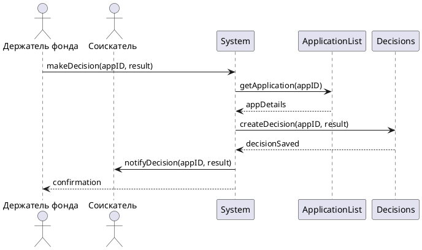

```plantuml
@startuml
actor "Держатель фонда" as FundHolder
actor "Соискатель" as Applicant
participant System
participant ApplicationList
participant Decisions

FundHolder -> System : makeDecision(appID, result)
System -> ApplicationList : getApplication(appID)
ApplicationList --> System : appDetails

System -> Decisions : createDecision(appID, result)
Decisions --> System : decisionSaved

System -> Applicant : notifyDecision(appID, result)
System --> FundHolder : confirmation
@enduml


```