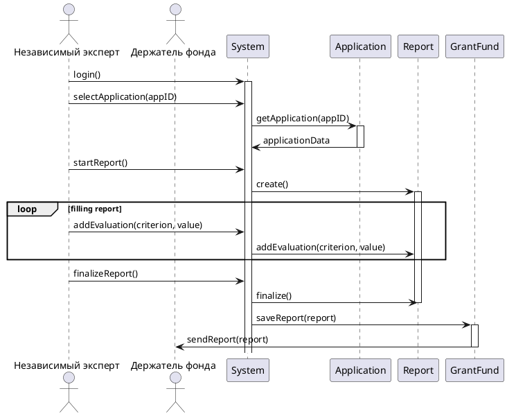

```plantuml
@startuml

actor "Независимый эксперт" as Expert
actor "Держатель фонда" as FundHolder

Expert -> System : login()
activate System

Expert -> System : selectApplication(appID)
System -> Application : getApplication(appID)
activate Application
System <- Application : applicationData
deactivate Application

Expert -> System : startReport()
System -> Report : create()
activate Report

loop filling report
    Expert -> System : addEvaluation(criterion, value)
    System -> Report : addEvaluation(criterion, value)
end

Expert -> System : finalizeReport()
System -> Report : finalize()
deactivate Report

System -> GrantFund : saveReport(report)
activate GrantFund
GrantFund -> FundHolder : sendReport(report)
deactivate GrantFund


@enduml

```
   ~~FundHolder <- GrantFund : reportReceived~~