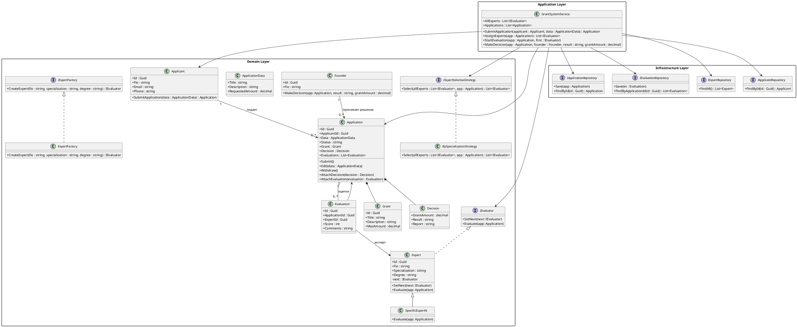

```plantuml
@startuml

skinparam shadowing false
skinparam classAttributeIconSize 0
skinparam classFontSize 13
skinparam packageStyle rectangle

package "Domain Layer" {

  ' ---------- Актеры ----------
  class Applicant { 
      + Id : Guid
      + Fio : string
      + Email : string
      + Phone : string
      + SubmitApplication(data : ApplicationData) : Application
  }

  interface IEvaluator {
      + SetNext(next: IEvaluator)
      + Evaluate(app: Application)
  }

  class Expert implements IEvaluator {
      + Id : Guid
      + Fio : string
      + Specialization : string
      + Degree : string
      - next : IEvaluator
      + SetNext(next: IEvaluator)
      + Evaluate(app: Application)
  }

  class SpecificExpertN {
      + Evaluate(app: Application)
  }
  Expert <|-- SpecificExpertN

  class Founder {
      + Id : Guid
      + Fio : string
      + MakeDecision(app: Application, result : string, grantAmount : decimal)
  }

  ' ---------- Корень агрегата ----------
  class Application {
      + Id : Guid
      + ApplicantId : Guid
      + Data : ApplicationData
      + Status : string
      + Grant : Grant
      + Decision : Decision
      + Evaluations : List<Evaluation>
      + Submit()
      + Edit(data : ApplicationData)
      + Withdraw()
      + AttachDecision(decision : Decision)
      + AttachEvaluation(evaluation : Evaluation)
  }

  class ApplicationData {
      + Title : string
      + Description : string
      + RequestedAmount : decimal
  }

  class Grant {
      + Id : Guid
      + Title : string
      + Description : string
      + MaxAmount : decimal
  }

  class Decision {
      + GrantAmount : decimal
      + Result : string
      + Report : string
  }

  class Evaluation {
      + Id : Guid
      + ApplicationId : Guid
      + ExpertId : Guid
      + Score : int
      + Comments : string
  }

  ' ---------- Стратегия ----------
  interface IExpertSelectionStrategy {
      + Select(allExperts : List<IEvaluator>, app : Application) : List<IEvaluator>
  }

  class BySpecializationStrategy {
      + Select(allExperts : List<IEvaluator>, app : Application) : List<IEvaluator>
  }
  IExpertSelectionStrategy <|.. BySpecializationStrategy

  ' ---------- Фабрика ----------
  interface IExpertFactory {
      + CreateExpert(fio : string, specialization : string, degree : string) : IEvaluator
  }

  class ExpertFactory {
      + CreateExpert(fio : string, specialization : string, degree : string) : IEvaluator
  }
  IExpertFactory <|.. ExpertFactory

  ' ---------- Свзяи в домене ----------
  Application *-- Grant
  Application *-- Decision
  Application "1" o-- "0..*" Evaluation : оценки

  Evaluation --> Application
  Evaluation --> Expert : "эксперт"

  Applicant "1" --> "0..*" Application : подает
  Founder "1" --> "0..*" Application : принимает решение
}

package "Infrastructure Layer" {

  interface IApplicationRepository {
      + Save(app : Application)
      + FindById(id : Guid) : Application
  }

  interface IEvaluationRepository {
      + Save(ev : Evaluation)
      + FindByApplicationId(id : Guid) : List<Evaluation>
  }

  interface IExpertRepository {
      + FindAll() : List<Expert>
  }

  interface IApplicantRepository {
      + FindById(id : Guid) : Applicant
  }
}


package "Application Layer" {

  class GrantSystemService {
      + AllExperts : List<IEvaluator>
      + Applications : List<Application>
      + SubmitApplication(applicant : Applicant, data : ApplicationData) : Application
      + AssignExperts(app : Application) : List<IEvaluator>
      + StartEvaluation(app : Application, first : IEvaluator)
      + MakeDecision(app : Application, founder : Founder, result : string, grantAmount : decimal)
  }

  GrantSystemService --> IApplicationRepository
  GrantSystemService --> IEvaluationRepository
  GrantSystemService --> IExpertRepository
  GrantSystemService --> IApplicantRepository

  GrantSystemService --> IExpertSelectionStrategy
  GrantSystemService --> Applicant
  GrantSystemService --> IEvaluator
  GrantSystemService --> Application
}

@enduml
```
