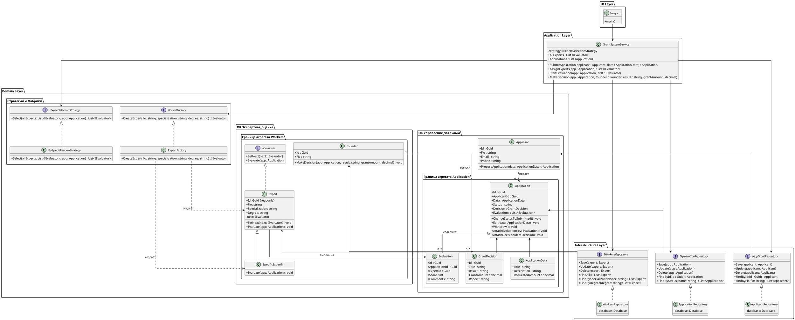

```plantuml
@startuml
skinparam shadowing false
skinparam classAttributeIconSize 0
skinparam classFontSize 13
skinparam packageStyle rectangle
skinparam packageStyle folder
skinparam linetype polyline
skinparam linetype ortho
 
package "UI Layer" {
    class Program {
      + main()
    }
}
 
package "Application Layer" {
  class GrantSystemService {
      - strategy: IExpertSelectionStrategy
      + AllExperts : List<IEvaluator>
      + Applications : List<Application>
      + SubmitApplication(applicant : Applicant, data : ApplicationData) : Application
      + AssignExperts(app : Application) : List<IEvaluator>
      + StartEvaluation(app : Application, first : IEvaluator)
      + MakeDecision(app : Application, founder : Founder, result : string, grantAmount : decimal)
  }
 
  Program --> GrantSystemService
}
 
package "Domain Layer" {
 
  package "Стратегии и Фабрики" as Policies {
      interface IExpertSelectionStrategy {
        + Select(allExperts: List<IEvaluator>, app: Application) : List<IEvaluator>
      }
 
      class BySpecializationStrategy implements IExpertSelectionStrategy {
        + Select(allExperts: List<IEvaluator>, app: Application) : List<IEvaluator>
      }
 
      interface IExpertFactory {
        + CreateExpert(fio: string, specialization: string, degree: string) : IEvaluator
      }
 
      class ExpertFactory implements IExpertFactory {
        + CreateExpert(fio: string, specialization: string, degree: string) : IEvaluator
      }
  }
 
  package "ОК Экспертная_оценка" as ExpertBC {
      package "Граница агрегата Workers" {
          interface IEvaluator {
            + SetNext(next: IEvaluator)
            + Evaluate(app: Application)
          }
 
          class Expert implements IEvaluator {
            + Id: Guid {readonly}
            + Fio: string
            + Specialization: string
            + Degree: string
            - next: IEvaluator
            + SetNext(next: IEvaluator) : void
            + Evaluate(app: Application) : void
          }
 
          class SpecificExpertN extends Expert {
            + Evaluate(app: Application) : void
          }
 
          class Founder {
            + Id : Guid
            + Fio : string
            + MakeDecision(app: Application, result: string, grantAmount: decimal) : void
          }
      }
  }
 
  package "ОК Управление_заявками" as AppBC {
      package "Граница агрегата Application" {
          class Application {
              + Id : Guid
              + ApplicantId : Guid
              + Data : ApplicationData
              + Status : string
              + Decision : GrantDecision
              + Evaluations : List<Evaluation>
              + ChangeStatusToSubmitted() : void
              + Edit(data: ApplicationData) : void
              + Withdraw() : void
              + AttachEvaluation(ev: Evaluation) : void
              + AttachDecision(dec: Decision) : void
          }
 
          class ApplicationData {
              + Title : string
              + Description : string
              + RequestedAmount : decimal
          }
 
          class GrantDecision {
              + Id : Guid
              + Title : string
              + Result : string
              + GrantAmount : decimal
              + Report : string
          }
 
          class Evaluation {
              + Id : Guid
              + ApplicationId : Guid
              + ExpertId : Guid
              + Score : int
              + Comments : string
          }
      }
 
      class Applicant { 
        + Id : Guid
        + Fio : string
        + Email : string
        + Phone : string
        + PrepareApplication(data: ApplicationData) : Application
      }
  }
}

package "Infrastructure Layer" {
      interface IApplicationRepository {
          + Save(app : Application)
          + Update(app : Application)
          + Delete(app : Application)
          + FindById(id : Guid) : Application
          + FindByStatus(status: string) : List<Application>
      }
 
      interface IWorkersRepository {
          + Save(expert: Expert)
          + Update(expert: Expert)
          + Delete(expert: Expert)
          + FindAll() : List<Expert>
          + FindBySpecialization(spec: string): List<Expert>
          + FindByDegree(degree: string): List<Expert>
      }
 
      interface IApplicantRepository {
          + Save(applicant: Applicant)
          + Update(applicant: Applicant)
          + Delete(applicant: Applicant)
          + FindById(id : Guid) : Applicant
          + FindByFio(fio: string) : List<Applicant>
      }
 
      class ApplicationRepository implements IApplicationRepository{
          - database: Database
      }
 
      class WorkersRepository implements IWorkersRepository{
          - database: Database
      }
 
      class ApplicantRepository implements IApplicantRepository{
          -database: Database
      }
}
 
Applicant "1" --> "0..*" Application : подаёт
Founder "1" --> "0..*" GrantDecision : выносит
 
Application *-- ApplicationData
Application *-- GrantDecision
Application "1" o-- "0..*" Evaluation : содержит
 
Expert --> Evaluation : выполнил
 
GrantSystemService --> IApplicationRepository
GrantSystemService --> IWorkersRepository
GrantSystemService --> IApplicantRepository
GrantSystemService --> IExpertFactory
GrantSystemService --> IExpertSelectionStrategy
 
ExpertFactory ..> Expert : создаёт
ExpertFactory ..> SpecificExpertN : создаёт
 
IApplicationRepository -up-> Application
IWorkersRepository -up-> Expert
IWorkersRepository -up-> Founder
IApplicantRepository -up-> Applicant
 
@enduml
```