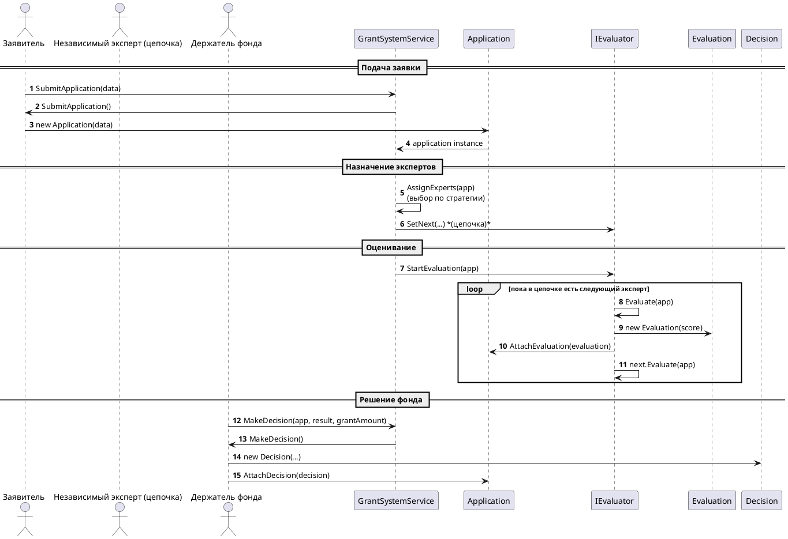

```plantuml
@startuml
autonumber

actor "Заявитель" as Applicant
actor "Независимый эксперт (цепочка)" as Expert
actor "Держатель фонда" as Founder

participant "GrantSystemService" as Service
participant "Application" as App
participant "IEvaluator" as Evaluator
participant "Evaluation" as Evaluation
participant "Decision" as Decision

== Подача заявки ==
Applicant -> Service : SubmitApplication(data)
Service -> Applicant : SubmitApplication()
Applicant -> App : new Application(data)
Service <- App : application instance

== Назначение экспертов ==
Service -> Service : AssignExperts(app)\n(выбор по стратегии)
Service -> Evaluator : SetNext(...) *(цепочка)*

== Оценивание ==
Service -> Evaluator : StartEvaluation(app)
loop пока в цепочке есть следующий эксперт
    Evaluator -> Evaluator : Evaluate(app)
    Evaluator -> Evaluation : new Evaluation(score)
    Evaluator -> App : AttachEvaluation(evaluation)
    Evaluator -> Evaluator : next.Evaluate(app)
end

== Решение фонда ==
Founder -> Service : MakeDecision(app, result, grantAmount)
Service -> Founder : MakeDecision()
Founder -> Decision : new Decision(...)
Founder -> App : AttachDecision(decision)

@enduml

```