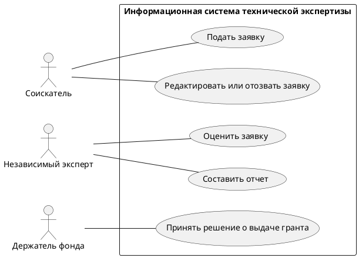

```plantuml
@startuml
left to right direction

actor "Соискатель" as Applicant
actor "Независимый эксперт" as Expert
actor "Держатель фонда" as FundHolder

rectangle "Информационная система технической экспертизы" {
    (Подать заявку) as SubmitApp
    (Редактировать или отозвать заявку) as EditApp
    (Оценить заявку) as EvaluateApp
    (Составить отчет) as ReportApp
    (Принять решение о выдаче гранта) as MakeDecision
}

Applicant -- SubmitApp
Applicant -- EditApp

Expert -- EvaluateApp
Expert -- ReportApp

FundHolder -- MakeDecision
@enduml
```
