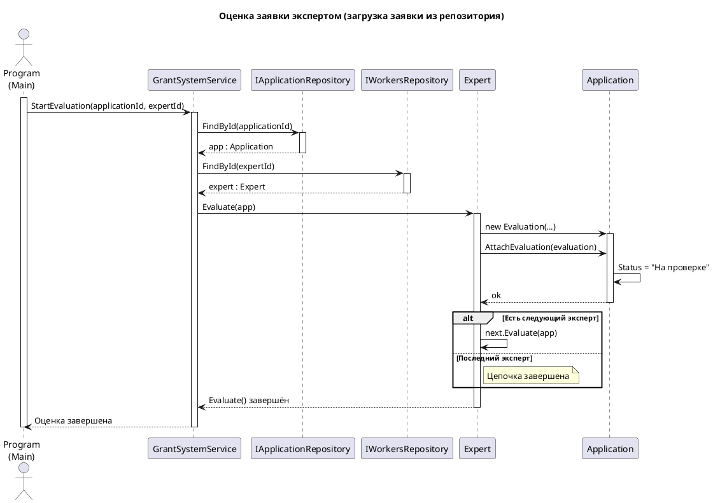

```plantuml
@startuml
title Оценка заявки экспертом (загрузка заявки из репозитория)

actor "Program\n(Main)" as program
participant "GrantSystemService" as service
participant "IApplicationRepository" as appRepo
participant "IWorkersRepository" as workerRepo
participant "Expert" as expert
participant "Application" as app

activate program

program -> service: StartEvaluation(applicationId, expertId)
activate service

' получить заявку
service -> appRepo: FindById(applicationId)
activate appRepo
appRepo --> service: app : Application
deactivate appRepo

' эксперт
service -> workerRepo: FindById(expertId)
activate workerRepo
workerRepo --> service: expert : Expert
deactivate workerRepo

' начать оценку
service -> expert: Evaluate(app)
activate expert

expert -> app: new Evaluation(...)
activate app
expert -> app: AttachEvaluation(evaluation)
app -> app: Status = "На проверке"
app --> expert: ok
deactivate app

alt Есть следующий эксперт
    expert -> expert: next.Evaluate(app)
else Последний эксперт
    note right of expert: Цепочка завершена
end

expert --> service: Evaluate() завершён
deactivate expert

service --> program: Оценка завершена
deactivate service
deactivate program

@enduml
```
