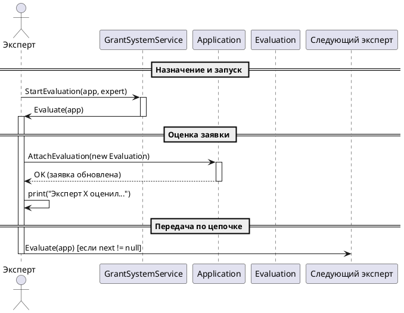

```plantuml
@startuml
actor "Эксперт" as Expert

participant "GrantSystemService" as Service
participant "Application" as App
participant "Evaluation" as Eval
participant "Следующий эксперт" as NextExpert

== Назначение и запуск ==

Expert -> Service : StartEvaluation(app, expert)
activate Service
Service -> Expert : Evaluate(app)
deactivate Service

== Оценка заявки ==

activate Expert
Expert -> App : AttachEvaluation(new Evaluation)
activate App
App --> Expert : OK (заявка обновлена)
deactivate App

Expert -> Expert : print("Эксперт X оценил...")

== Передача по цепочке ==
Expert -> NextExpert : Evaluate(app) [если next != null]
deactivate Expert

@enduml
```
