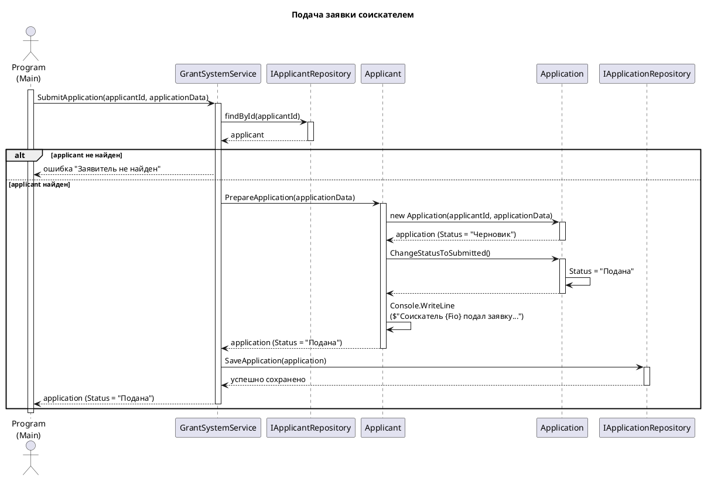

```plantuml
@startuml
title Подача заявки соискателем

actor "Program\n(Main)" as program
participant "GrantSystemService" as service
participant "IApplicantRepository" as applicantRepo
participant "Applicant" as applicantObj
participant "Application" as app
participant "IApplicationRepository" as applicationRepo

activate program

program -> service: SubmitApplication(applicantId, applicationData)
activate service

service -> applicantRepo: findById(applicantId)
activate applicantRepo

applicantRepo --> service: applicant
deactivate applicantRepo

alt applicant не найден
    service --> program: ошибка "Заявитель не найден"
else applicant найден
service -> applicantObj: PrepareApplication(applicationData)
activate applicantObj

applicantObj -> app: new Application(applicantId, applicationData)
activate app

app --> applicantObj: application (Status = "Черновик")
deactivate app

applicantObj -> app: ChangeStatusToSubmitted()
activate app
app -> app: Status = "Подана"
app --> applicantObj
deactivate app

applicantObj -> applicantObj: Console.WriteLine\n($"Соискатель {Fio} подал заявку...")
applicantObj --> service: application (Status = "Подана")
deactivate applicantObj

service -> applicationRepo: SaveApplication(application)
activate applicationRepo

applicationRepo --> service: успешно сохранено
deactivate applicationRepo

service --> program: application (Status = "Подана")
deactivate service
end

deactivate program

@enduml
```
