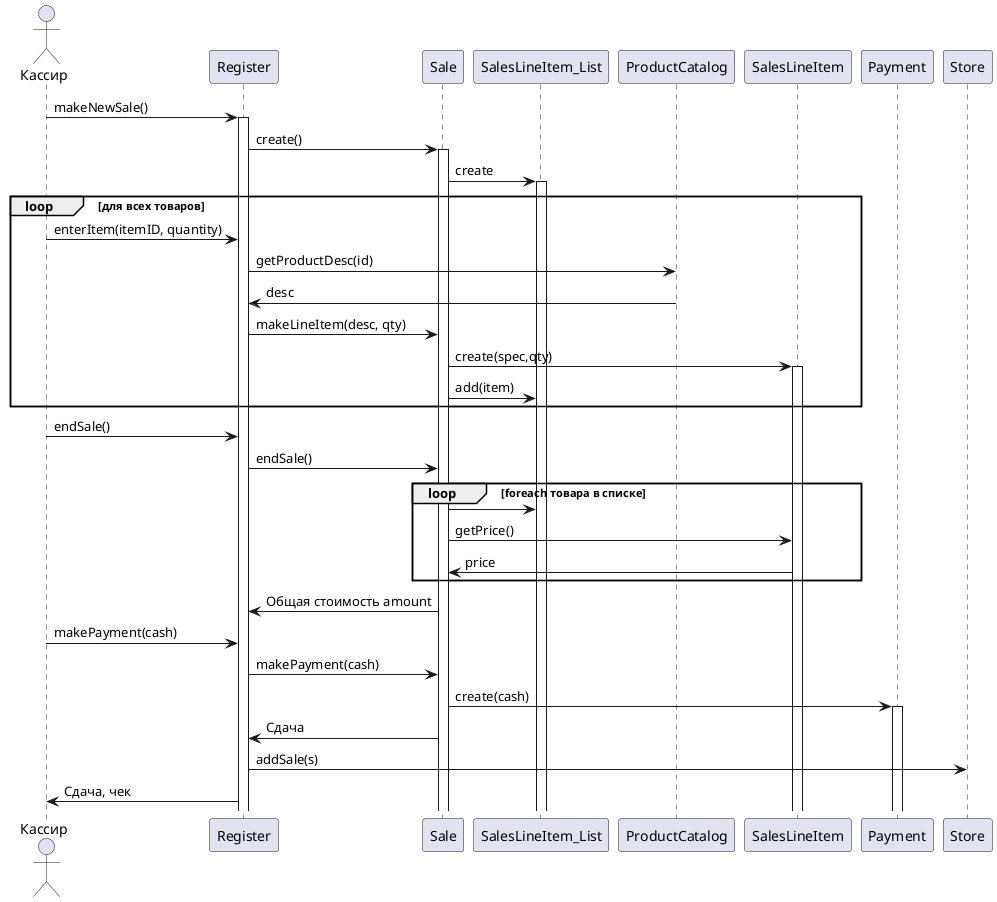

```plantuml
@startuml

actor Кассир

Кассир -> Register : makeNewSale()
activate Register
Register -> Sale : create()
activate Sale
Sale -> SalesLineItem_List : create
activate SalesLineItem_List
loop для всех товаров
Кассир -> Register : enterItem(itemID, quantity)
Register -> ProductCatalog : getProductDesc(id)
Register <- ProductCatalog : desc
Register -> Sale : makeLineItem(desc, qty)
Sale -> SalesLineItem : create(spec,qty)
activate SalesLineItem
Sale -> SalesLineItem_List : add(item)
end
Кассир -> Register : endSale()
Register -> Sale : endSale()
loop foreach товара в списке
Sale -> SalesLineItem_List
Sale -> SalesLineItem : getPrice()
Sale <- SalesLineItem : price
end
Register <- Sale : Общая стоимость amount
Кассир -> Register : makePayment(cash)
Register -> Sale : makePayment(cash)
Sale -> Payment : create(cash)
activate Payment
Register <- Sale : Сдача
Register -> Store : addSale(s)
Кассир <- Register : Сдача, чек
@enduml
```