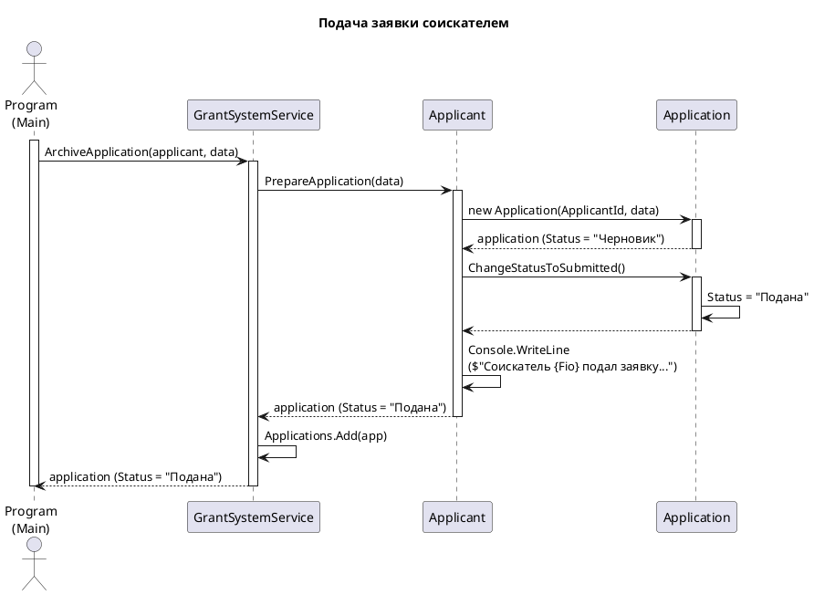

```plantuml
@startuml
title Подача заявки соискателем

actor "Program\n(Main)" as program
participant "GrantSystemService" as service
participant "Applicant" as applicantObj
participant "Application" as app

activate program

program -> service: ArchiveApplication(applicant, data)
activate service

service -> applicantObj: PrepareApplication(data)
activate applicantObj

applicantObj -> app: new Application(ApplicantId, data)
activate app

app --> applicantObj: application (Status = "Черновик")
deactivate app

applicantObj -> app: ChangeStatusToSubmitted()
activate app
app -> app: Status = "Подана"
app --> applicantObj
deactivate app

applicantObj -> applicantObj: Console.WriteLine\n($"Соискатель {Fio} подал заявку...")
applicantObj --> service: application (Status = "Подана")
deactivate applicantObj

service -> service: Applications.Add(app)

service --> program: application (Status = "Подана")
deactivate service

deactivate program

@enduml
```