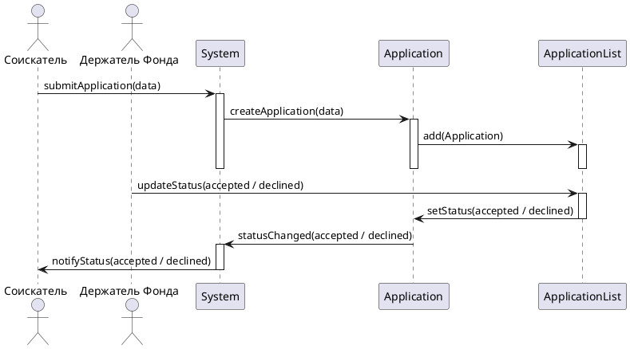
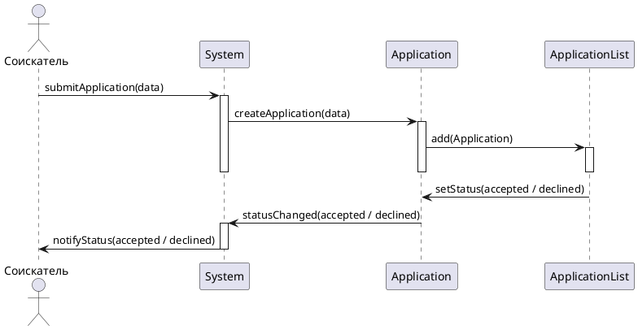

```plantuml
@startuml

actor Соискатель
actor "Держатель Фонда"

participant System
participant Application
participant ApplicationList

Соискатель -> System : submitApplication(data)
activate System
System -> Application : createApplication(data)
activate Application
Application -> ApplicationList : add(Application)
activate ApplicationList
deactivate Application
deactivate ApplicationList
deactivate System

"Держатель Фонда" -> ApplicationList : updateStatus(accepted / declined)
activate ApplicationList
ApplicationList -> Application : setStatus(accepted / declined)
deactivate ApplicationList

Application -> System : statusChanged(accepted / declined)
activate System
System -> Соискатель : notifyStatus(accepted / declined)
deactivate System

@enduml

```

```plantuml
@startuml

actor Соискатель

participant System
participant Application
participant ApplicationList

Соискатель -> System : submitApplication(data)
activate System
System -> Application : createApplication(data)
activate Application
Application -> ApplicationList : add(Application)
activate ApplicationList
deactivate Application
deactivate ApplicationList
deactivate System

ApplicationList -> Application : setStatus(accepted / declined)
deactivate ApplicationList

Application -> System : statusChanged(accepted / declined)
activate System
System -> Соискатель : notifyStatus(accepted / declined)
deactivate System

@enduml

```