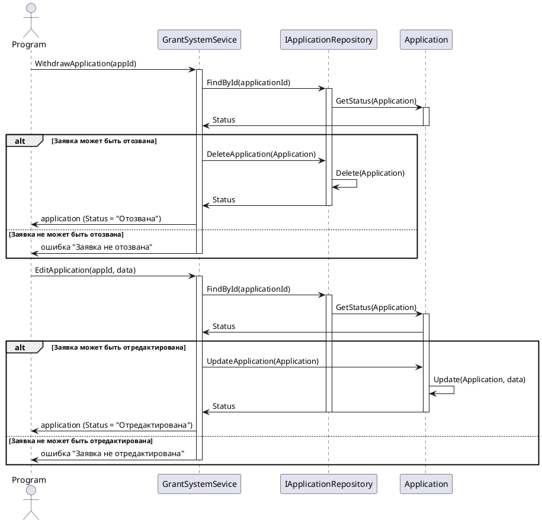

```plantuml
@startuml

actor Program
participant GrantSystemSevice
participant IApplicationRepository
participant Application

Program -> GrantSystemSevice: WithdrawApplication(appId)
activate GrantSystemSevice
GrantSystemSevice -> IApplicationRepository: FindById(applicationId)
activate IApplicationRepository
IApplicationRepository -> Application: GetStatus(Application)
activate Application
Application -> GrantSystemSevice: Status
deactivate Application

alt Заявка может быть отозвана
	GrantSystemSevice -> IApplicationRepository: DeleteApplication(Application)
	IApplicationRepository -> IApplicationRepository: Delete(Application)
	IApplicationRepository -> GrantSystemSevice: Status
	deactivate IApplicationRepository
	GrantSystemSevice -> Program: application (Status = "Отозвана")
else Заявка не может быть отозвана
	GrantSystemSevice -> Program: ошибка "Заявка не отозвана"
	deactivate GrantSystemSevice
end

Program -> GrantSystemSevice: EditApplication(appId, data)
activate GrantSystemSevice
GrantSystemSevice -> IApplicationRepository: FindById(applicationId)
activate IApplicationRepository
IApplicationRepository -> Application: GetStatus(Application)
activate Application
Application -> GrantSystemSevice: Status

alt Заявка может быть отредактирована
	GrantSystemSevice -> Application: UpdateApplication(Application)
	Application -> Application: Update(Application, data)
	Application -> GrantSystemSevice: Status
	deactivate Application
	deactivate IApplicationRepository
	GrantSystemSevice -> Program: application (Status = "Отредактирована")
else Заявка не может быть отредактирована
	GrantSystemSevice -> Program: ошибка "Заявка не отредактирована"
	deactivate GrantSystemSevice
end

@enduml
```