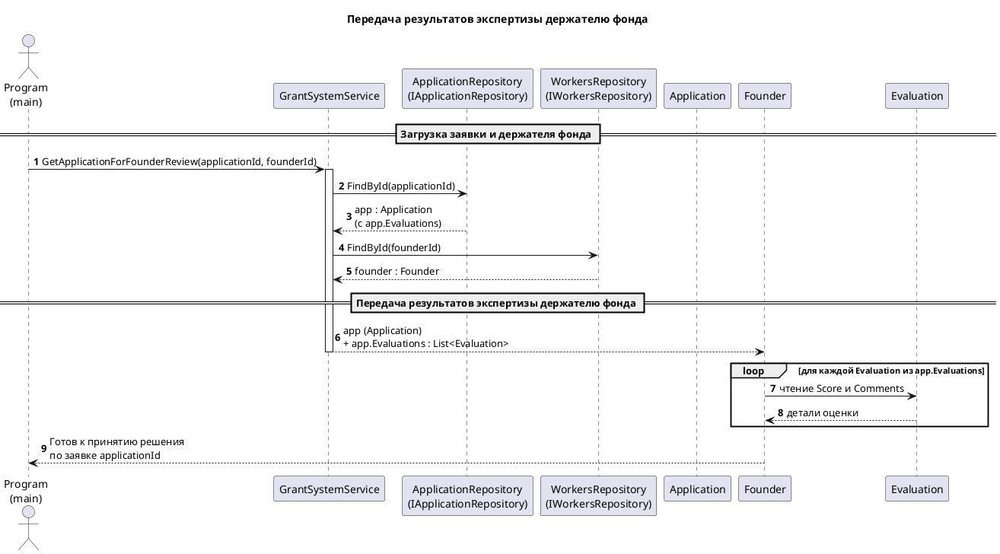

```plantuml
@startuml
title Передача результатов экспертизы держателю фонда

autonumber

actor "Program\n(main)" as Program

participant "GrantSystemService" as GrantSystemService
participant "ApplicationRepository\n(IApplicationRepository)" as AppRepo
participant "WorkersRepository\n(IWorkersRepository)" as WorkersRepo
participant "Application" as Application
participant "Founder" as Founder
participant "Evaluation" as Evaluation

== Загрузка заявки и держателя фонда ==

Program -> GrantSystemService: GetApplicationForFounderReview(applicationId, founderId)
activate GrantSystemService

GrantSystemService -> AppRepo: FindById(applicationId)
AppRepo --> GrantSystemService: app : Application\n(с app.Evaluations)

GrantSystemService -> WorkersRepo: FindById(founderId)
WorkersRepo --> GrantSystemService: founder : Founder

== Передача результатов экспертизы держателю фонда ==

GrantSystemService --> Founder: app (Application)\n+ app.Evaluations : List<Evaluation>
deactivate GrantSystemService

loop для каждой Evaluation из app.Evaluations
    Founder -> Evaluation: чтение Score и Comments
    Evaluation --> Founder: детали оценки
end

Founder --> Program: Готов к принятию решения\nпо заявке applicationId

deactivate Founder
deactivate Program
@enduml
```

