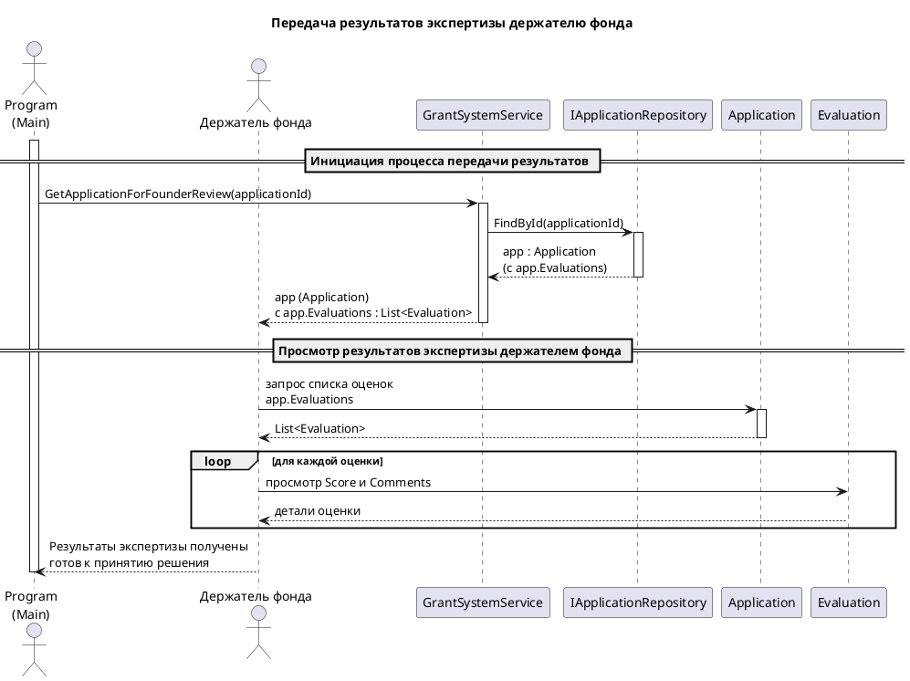

```plantuml
@startuml
title Передача результатов экспертизы держателю фонда

actor "Program\n(Main)" as program
actor "Держатель фонда" as founderActor

participant "GrantSystemService" as service
participant "IApplicationRepository" as appRepo
participant "Application" as app
participant "Evaluation" as evaluation

== Инициация процесса передачи результатов ==

activate program

' UI / Main инициирует получение заявки для рассмотрения фондом
program -> service: GetApplicationForFounderReview(applicationId)
activate service

' Загрузка заявки с уже выполненными оценками (после экспертов)
service -> appRepo: FindById(applicationId)
activate appRepo
appRepo --> service: app : Application\n(c app.Evaluations)
deactivate appRepo

' Передача заявки и её оценок держателю фонда
service --> founderActor: app (Application)\nс app.Evaluations : List<Evaluation>
deactivate service

== Просмотр результатов экспертизы держателем фонда ==

' Держатель фонда изучает вложенные оценки
founderActor -> app: запрос списка оценок\napp.Evaluations
activate app
app --> founderActor: List<Evaluation>
deactivate app

loop для каждой оценки
    founderActor -> evaluation: просмотр Score и Comments
    evaluation --> founderActor: детали оценки
end

' После этого держатель фонда готов к прецеденту\n«Принятие решения о выдаче гранта»
founderActor --> program: Результаты экспертизы получены\nготов к принятию решения

deactivate founderActor
deactivate program

@enduml
```

